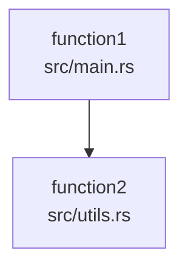
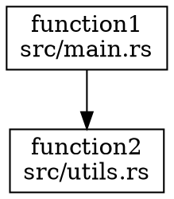

# CodeGraph CLI

一个完整的代码依赖分析工具，使用PetGraph构建代码调用图，支持多种编程语言和导出格式。

## 功能特性

- **多语言支持**: 解析Rust、Python、JavaScript/TypeScript、Java、C/C++等编程语言
- **智能解析**: 使用Tree-sitter进行准确的AST解析
- **图分析**: 基于PetGraph的高效图操作和分析
- **多种导出格式**: JSON、Mermaid、DOT、GraphML、GEXF
- **高级分析**: 循环依赖检测、调用链分析、复杂度分析
- **命令行工具**: 简单易用的CLI界面
- **库支持**: 可作为Rust库集成到其他项目中

## 安装

### 从源码构建

```bash
# 克隆仓库
git clone <repository-url>
cd codegraph-cli

# 构建项目
cargo build --release

# 安装到系统
cargo install --path .
```

### 依赖要求

- Rust 1.70+
- 支持的操作系统: Linux, macOS, Windows

## 使用方法

### 命令行工具

```bash
# 基本用法 - 分析目录并输出JSON
codegraph-cli --input /path/to/source/code --output codegraph.json

# 输出Mermaid格式用于可视化
codegraph-cli --input /path/to/source/code --output graph.mmd --format mermaid

# 输出DOT格式用于Graphviz
codegraph-cli --input /path/to/source/code --output graph.dot --format dot

# 输出GraphML格式用于可视化工具
codegraph-cli --input /path/to/source/code --output graph.graphml --format graphml

# 输出GEXF格式用于Gephi
codegraph-cli --input /path/to/source/code --output graph.gexf --format gexf

# 详细模式输出详细信息
codegraph-cli --input /path/to/source/code --verbose
```

### 作为库使用

```rust
use codegraph_cli::codegraph::{
    CodeParser, CodeGraphAnalyzer, PetGraphStorageManager
};
use std::path::Path;

fn main() -> Result<(), Box<dyn std::error::Error>> {
    // 创建代码解析器
    let mut parser = CodeParser::new();
    
    // 构建代码图
    let code_graph = parser.build_petgraph_code_graph(Path::new("src"))?;
    
    // 使用分析器进行高级分析
    let mut analyzer = CodeGraphAnalyzer::new();
    analyzer.analyze_directory(Path::new("src"))?;
    
    // 查找循环依赖
    let cycles = analyzer.find_circular_dependencies();
    if !cycles.is_empty() {
        println!("发现循环依赖!");
    }
    
    // 导出为不同格式
    let mermaid = code_graph.to_mermaid();
    std::fs::write("graph.mmd", mermaid)?;
    
    Ok(())
}
```

## 示例

### 生成Mermaid图

```bash
codegraph-cli --input ./src --output graph.mmd --format mermaid
```

这将生成一个Mermaid图表，可以在Markdown查看器或在线Mermaid编辑器中渲染。

### 生成DOT图用于Graphviz

```bash
codegraph-cli --input ./src --output graph.dot --format dot
```

然后可以使用Graphviz渲染DOT文件：

```bash
dot -Tpng graph.dot -o graph.png
```

### 分析特定项目

```bash
codegraph-cli --input /path/to/my/project --output project-graph.json
```

## 输出格式

### JSON
默认的JSON格式包含函数、调用关系和统计信息的详细数据。

### Mermaid
基于文本的图表格式，可以在Markdown查看器中渲染：



### DOT
Graphviz格式，用于生成高质量图表：



## API文档

### 核心组件

#### CodeParser
代码解析器，负责解析源代码文件并提取函数信息：

```rust
pub struct CodeParser {
    // 内部实现
}

impl CodeParser {
    pub fn new() -> Self;
    pub fn build_code_graph(&mut self, dir: &Path) -> Result<CodeGraph, String>;
    pub fn build_petgraph_code_graph(&mut self, dir: &Path) -> Result<PetCodeGraph, String>;
}
```

#### CodeGraphAnalyzer
代码图分析器，提供高级分析功能：

```rust
pub struct CodeGraphAnalyzer {
    parser: CodeParser,
    code_graph: Option<CodeGraph>,
}

impl CodeGraphAnalyzer {
    pub fn new() -> Self;
    pub fn analyze_directory(&mut self, dir: &Path) -> Result<&CodeGraph, String>;
    pub fn find_callers(&self, function_name: &str) -> Vec<&FunctionInfo>;
    pub fn find_callees(&self, function_name: &str) -> Vec<&FunctionInfo>;
    pub fn find_call_chains(&self, function_name: &str, max_depth: usize) -> Vec<Vec<&FunctionInfo>>;
    pub fn find_circular_dependencies(&self) -> Vec<Vec<&FunctionInfo>>;
    pub fn find_most_complex_functions(&self, limit: usize) -> Vec<(&FunctionInfo, usize)>;
    pub fn generate_call_report(&self) -> String;
}
```

#### PetCodeGraph
基于PetGraph的图数据结构：

```rust
pub struct PetCodeGraph {
    pub graph: DiGraph<FunctionInfo, CallRelation>,
    pub function_to_node: HashMap<Uuid, NodeIndex>,
    pub node_to_function: HashMap<NodeIndex, Uuid>,
    pub function_names: HashMap<String, Vec<Uuid>>,
    pub file_functions: HashMap<PathBuf, Vec<Uuid>>,
    pub stats: CodeGraphStats,
}
```

### 数据结构

#### FunctionInfo
表示代码中的函数：

```rust
pub struct FunctionInfo {
    pub id: Uuid,
    pub name: String,
    pub file_path: PathBuf,
    pub line_start: usize,
    pub line_end: usize,
    pub namespace: String,
    pub language: String,
    pub signature: Option<String>,
    pub return_type: Option<String>,
    pub parameters: Vec<ParameterInfo>,
}
```

#### CallRelation
表示函数调用关系：

```rust
pub struct CallRelation {
    pub caller_id: Uuid,
    pub callee_id: Uuid,
    pub caller_name: String,
    pub callee_name: String,
    pub caller_file: PathBuf,
    pub callee_file: PathBuf,
    pub line_number: usize,
    pub is_resolved: bool,
}
```

## 支持的语言

代码解析器支持多种编程语言：

- **Rust**: `.rs`
- **Python**: `.py`, `.py3`, `.pyx`
- **JavaScript/TypeScript**: `.js`, `.jsx`, `.ts`, `.tsx`
- **Java**: `.java`
- **C/C++**: `.c`, `.cpp`, `.cc`, `.cxx`, `.c++`, `.h`, `.hpp`, `.hxx`, `.hh`

## 性能特性

使用PetGraph提供以下性能优势：

1. **高效图操作**: O(1)节点/边访问，大多数算法为O(V+E)
2. **内存效率**: 紧凑的图结构表示
3. **快速算法**: 内置循环检测、拓扑排序等算法
4. **可扩展性**: 高效处理大型代码库

## 测试

运行测试套件：

```bash
# 运行所有测试
cargo test

# 运行特定测试
cargo test test_analyzer_basic_functionality

# 运行测试并显示输出
cargo test -- --nocapture
```

## 开发

### 项目结构

```
codegraph-cli/
├── src/
│   ├── main.rs              # CLI入口点
│   ├── lib.rs               # 库入口点
│   └── codegraph/           # 核心代码图模块
│       ├── mod.rs           # 模块定义
│       ├── parser.rs        # 代码解析器
│       ├── graph.rs         # 图数据结构
│       ├── types.rs         # 类型定义
│       ├── analyzer.rs      # 分析器
│       ├── petgraph_storage.rs # 存储管理
│       ├── treesitter/      # Tree-sitter解析器
│       └── tests.rs         # 测试套件
├── Cargo.toml               # 项目配置
└── README.md                # 项目文档
```

### 添加新语言支持

1. 在`treesitter/`目录中添加新的语言解析器
2. 更新`parser.rs`中的语言检测逻辑
3. 添加相应的测试用例

### 添加新的导出格式

1. 在相应的图结构上实现新的导出方法
2. 更新CLI以支持新格式
3. 添加格式验证和测试

## 许可证

MIT License

## 贡献

欢迎贡献代码！请确保：

1. 运行所有测试通过
2. 遵循现有的代码风格
3. 添加适当的文档和测试
4. 提交清晰的提交信息

## 问题反馈

如果您遇到问题或有功能建议，请：

1. 检查现有问题
2. 创建新的问题报告
3. 提供详细的错误信息和重现步骤