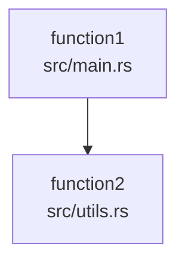
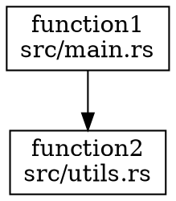

# CodeGraph CLI

一个完整的代码依赖分析工具，使用PetGraph构建代码调用图，支持多种编程语言和导出格式。

## 功能特性

- **多语言支持**: 解析Rust、Python、JavaScript/TypeScript、Java、C/C++等编程语言
- **智能解析**: 集成Tree-sitter进行AST解析（开发中）
- **图分析**: 基于PetGraph的高效图操作和分析
- **多种导出格式**: JSON、Mermaid、DOT、GraphML、GEXF
- **高级分析**: 循环依赖检测、调用链分析、复杂度分析
- **命令行工具**: 简单易用的CLI界面
- **库支持**: 可作为Rust库集成到其他项目中

## 当前状态

⚠️ **注意**: 当前版本是开发中的原型，具有以下特点：

- ✅ **完整的基础架构**: 图数据结构、类型系统、CLI框架
- ✅ **多格式导出**: 支持JSON、Mermaid、DOT、GraphML、GEXF
- ✅ **图分析算法**: 循环检测、拓扑排序、强连通分量
- 🔄 **代码解析**: 基础框架完成，但函数提取逻辑是简化版本
- 🔄 **调用关系分析**: 当前使用硬编码示例，需要实现真实解析
- 🔄 **Tree-sitter集成**: 依赖已配置，但解析器实现待完成

## 安装

### 从源码构建

```bash
# 克隆仓库
git clone <repository-url>
cd codegraph-core

# 构建项目
cargo build --release

# 安装到系统
cargo install --path .
```

### 依赖要求

- Rust 1.70+
- 支持的操作系统: Linux, macOS, Windows

## 使用方法

### 命令行工具

```bash
# 基本用法 - 分析目录并输出JSON
cargo run -- --input /path/to/source/code --output codegraph.json

# 输出Mermaid格式用于可视化
cargo run -- --input /path/to/source/code --output graph.mmd --format mermaid

# 输出DOT格式用于Graphviz
cargo run -- --input /path/to/source/code --output graph.dot --format dot

# 输出GraphML格式用于可视化工具
cargo run -- --input /path/to/source/code --output graph.graphml --format graphml

# 输出GEXF格式用于Gephi
cargo run -- --input /path/to/source/code --output graph.gexf --format gexf

# 详细模式输出详细信息
cargo run -- --input /path/to/source/code --verbose
```

### 实际示例

```bash
# 分析当前项目
cargo run -- --input ./src --output ./codegraph.json --verbose

# 生成Mermaid图表并在浏览器中查看
cargo run -- --input ./src --output ./graph.mmd --format mermaid
# 然后将生成的graph.mmd内容粘贴到 https://mermaid.live

# 生成DOT图并转换为PNG
cargo run -- --input ./src --output ./graph.dot --format dot
dot -Tpng graph.dot -o graph.png
```

### 作为库使用

```rust
use codegraph_cli::codegraph::{
    CodeParser, CodeGraphAnalyzer, PetGraphStorageManager
};
use std::path::Path;

fn main() -> Result<(), Box<dyn std::error::Error>> {
    // 创建代码解析器
    let mut parser = CodeParser::new();
    
    // 构建代码图
    let code_graph = parser.build_petgraph_code_graph(Path::new("src"))?;
    
    // 使用分析器进行高级分析
    let mut analyzer = CodeGraphAnalyzer::new();
    analyzer.analyze_directory(Path::new("src"))?;
    
    // 查找循环依赖
    let cycles = analyzer.find_circular_dependencies();
    if !cycles.is_empty() {
        println!("发现循环依赖!");
    }
    
    // 导出为不同格式
    let mermaid = code_graph.to_mermaid();
    std::fs::write("graph.mmd", mermaid)?;
    
    Ok(())
}
```

### 高级分析示例

```rust
use codegraph_cli::codegraph::CodeGraphAnalyzer;
use std::path::Path;

fn analyze_codebase() -> Result<(), Box<dyn std::error::Error>> {
    let mut analyzer = CodeGraphAnalyzer::new();
    analyzer.analyze_directory(Path::new("src"))?;
    
    // 获取统计信息
    if let Some(stats) = analyzer.get_stats() {
        println!("总函数数: {}", stats.total_functions);
        println!("总文件数: {}", stats.total_files);
        println!("支持的语言: {:?}", stats.languages);
    }
    
    // 查找特定函数的调用者
    let callers = analyzer.find_callers("main");
    println!("main函数的调用者: {}", callers.len());
    
    // 查找调用链
    let chains = analyzer.find_call_chains("main", 3);
    println!("main函数的调用链数量: {}", chains.len());
    
    // 查找最复杂的函数
    let complex_functions = analyzer.find_most_complex_functions(5);
    println!("最复杂的5个函数:");
    for (func, complexity) in complex_functions {
        println!("  {} (复杂度: {})", func.name, complexity);
    }
    
    // 生成调用报告
    let report = analyzer.generate_call_report();
    std::fs::write("call_report.txt", report)?;
    
    Ok(())
}
```

## 示例

### 生成Mermaid图

```bash
cargo run -- --input ./src --output graph.mmd --format mermaid
```

这将生成一个Mermaid图表，可以在Markdown查看器或在线Mermaid编辑器中渲染。

### 生成DOT图用于Graphviz

```bash
cargo run -- --input ./src --output graph.dot --format dot
```

然后可以使用Graphviz渲染DOT文件：

```bash
dot -Tpng graph.dot -o graph.png
```

### 分析特定项目

```bash
cargo run -- --input /path/to/my/project --output project-graph.json
```

### 输出格式示例

#### JSON格式
```json
{
  "functions": [
    {
      "id": "550e8400-e29b-41d4-a716-446655440000",
      "name": "main",
      "file_path": "src/main.rs",
      "line_start": 1,
      "line_end": 10,
      "namespace": "global",
      "language": "rust",
      "signature": "fn main() -> Result<(), Box<dyn std::error::Error>>",
      "return_type": "Result<(), Box<dyn std::error::Error>>",
      "parameters": []
    }
  ],
  "call_relations": [
    {
      "caller_id": "550e8400-e29b-41d4-a716-446655440000",
      "callee_id": "550e8400-e29b-41d4-a716-446655440001",
      "caller_name": "main",
      "callee_name": "parse_code",
      "caller_file": "src/main.rs",
      "callee_file": "src/parser.rs",
      "line_number": 5,
      "is_resolved": true
    }
  ],
  "stats": {
    "total_functions": 10,
    "total_files": 3,
    "total_languages": 1,
    "resolved_calls": 8,
    "unresolved_calls": 2,
    "languages": {"rust": 10}
  }
}
```

## 输出格式

### JSON
默认的JSON格式包含函数、调用关系和统计信息的详细数据。

### Mermaid
基于文本的图表格式，可以在Markdown查看器中渲染：



### DOT
Graphviz格式，用于生成高质量图表：



### GraphML
XML格式，用于Gephi等可视化工具：

```xml
<?xml version="1.0" encoding="UTF-8"?>
<graphml xmlns="http://graphml.graphdrawing.org/xmlns">
  <key id="name" for="node" attr.name="name" attr.type="string"/>
  <key id="file" for="node" attr.name="file" attr.type="string"/>
  <graph id="codegraph" edgedefault="directed">
    <node id="function1">
      <data key="name">function1</data>
      <data key="file">src/main.rs</data>
    </node>
    <node id="function2">
      <data key="name">function2</data>
      <data key="file">src/utils.rs</data>
    </node>
    <edge source="function1" target="function2"/>
  </graph>
</graphml>
```

## API文档

### 核心组件

#### CodeParser
代码解析器，负责解析源代码文件并提取函数信息：

```rust
pub struct CodeParser {
    // 内部实现
}

impl CodeParser {
    pub fn new() -> Self;
    pub fn build_code_graph(&mut self, dir: &Path) -> Result<CodeGraph, String>;
    pub fn build_petgraph_code_graph(&mut self, dir: &Path) -> Result<PetCodeGraph, String>;
}
```

**当前实现状态**: 
- 基础文件扫描和语言检测已完成
- 函数提取使用简化逻辑（基于正则表达式）
- Tree-sitter解析器框架已集成，但具体实现待完成

#### CodeGraphAnalyzer
代码图分析器，提供高级分析功能：

```rust
pub struct CodeGraphAnalyzer {
    parser: CodeParser,
    code_graph: Option<CodeGraph>,
}

impl CodeGraphAnalyzer {
    pub fn new() -> Self;
    pub fn analyze_directory(&mut self, dir: &Path) -> Result<&CodeGraph, String>;
    pub fn find_callers(&self, function_name: &str) -> Vec<&FunctionInfo>;
    pub fn find_callees(&self, function_name: &str) -> Vec<&FunctionInfo>;
    pub fn find_call_chains(&self, function_name: &str, max_depth: usize) -> Vec<Vec<&FunctionInfo>>;
    pub fn find_circular_dependencies(&self) -> Vec<Vec<&FunctionInfo>>;
    pub fn find_most_complex_functions(&self, limit: usize) -> Vec<(&FunctionInfo, usize)>;
    pub fn generate_call_report(&self) -> String;
}
```

#### PetCodeGraph
基于PetGraph的图数据结构：

```rust
pub struct PetCodeGraph {
    pub graph: DiGraph<FunctionInfo, CallRelation>,
    pub function_to_node: HashMap<Uuid, NodeIndex>,
    pub node_to_function: HashMap<NodeIndex, Uuid>,
    pub function_names: HashMap<String, Vec<Uuid>>,
    pub file_functions: HashMap<PathBuf, Vec<Uuid>>,
    pub stats: CodeGraphStats,
}
```

**当前实现状态**: 
- 完整的图数据结构已实现
- 支持高效的图操作和算法
- 统计信息自动更新

### 数据结构

#### FunctionInfo
表示代码中的函数：

```rust
pub struct FunctionInfo {
    pub id: Uuid,
    pub name: String,
    pub file_path: PathBuf,
    pub line_start: usize,
    pub line_end: usize,
    pub namespace: String,
    pub language: String,
    pub signature: Option<String>,
    pub return_type: Option<String>,
    pub parameters: Vec<ParameterInfo>,
}
```

#### CallRelation
表示函数调用关系：

```rust
pub struct CallRelation {
    pub caller_id: Uuid,
    pub callee_id: Uuid,
    pub caller_name: String,
    pub callee_name: String,
    pub caller_file: PathBuf,
    pub callee_file: PathBuf,
    pub line_number: usize,
    pub is_resolved: bool,
}
```

## 支持的语言

代码解析器支持多种编程语言：

- **Rust**: `.rs`
- **Python**: `.py`, `.py3`, `.pyx`
- **JavaScript/TypeScript**: `.js`, `.jsx`, `.ts`, `.tsx`
- **Java**: `.java`
- **C/C++**: `.c`, `.cpp`, `.cc`, `.cxx`, `.c++`, `.h`, `.hpp`, `.hxx`, `.hh`

**注意**: 当前版本使用简化解析逻辑，实际函数提取基于正则表达式匹配。

## 性能特性

使用PetGraph提供以下性能优势：

1. **高效图操作**: O(1)节点/边访问，大多数算法为O(V+E)
2. **内存效率**: 紧凑的图结构表示
3. **快速算法**: 内置循环检测、拓扑排序等算法
4. **可扩展性**: 高效处理大型代码库

## 开发路线图

### 短期目标 (v0.2.0)
- [ ] 完善Tree-sitter解析器实现
- [ ] 实现真实的函数调用关系解析
- [ ] 改进函数签名和参数提取
- [ ] 添加更多语言特定的解析逻辑

### 中期目标 (v0.3.0)
- [ ] 支持类和方法解析
- [ ] 添加依赖注入和框架支持
- [ ] 实现增量解析
- [ ] 添加性能基准测试

### 长期目标 (v1.0.0)
- [ ] 支持大型代码库的分布式解析
- [ ] 添加机器学习辅助的依赖分析
- [ ] 集成IDE插件
- [ ] 支持更多编程语言

## 测试

运行测试套件：

```bash
# 运行所有测试
cargo test

# 运行特定测试
cargo test test_analyzer_basic_functionality

# 运行测试并显示输出
cargo test -- --nocapture

# 运行集成测试
cargo test --test integration_tests

# 运行性能测试
cargo test --test performance_tests --release
```

### 测试覆盖

当前测试覆盖以下功能：

- ✅ **基础功能测试**: 图数据结构、函数添加、关系管理
- ✅ **分析器测试**: 调用链分析、循环检测、统计计算
- ✅ **导出格式测试**: JSON、Mermaid、DOT格式转换
- ✅ **存储测试**: 文件保存和加载
- 🔄 **解析器测试**: 基础功能测试，需要更多真实代码样本
- 🔄 **集成测试**: 端到端工作流程测试

### 添加测试

```rust
#[cfg(test)]
mod tests {
    use super::*;
    
    #[test]
    fn test_new_language_support() {
        let mut parser = CodeParser::new();
        let result = parser.parse_file(&PathBuf::from("test.go"));
        assert!(result.is_ok());
        
        let functions = parser.get_functions();
        assert!(!functions.is_empty());
    }
    
    #[test]
    fn test_new_export_format() {
        let mut code_graph = PetCodeGraph::new();
        // 添加测试数据...
        
        let csv = code_graph.to_csv();
        assert!(csv.contains("function,file,language"));
    }
}
```

## 开发

### 项目结构

```
codegraph-core/
├── src/
│   ├── main.rs              # CLI入口点
│   ├── lib.rs               # 库入口点
│   └── codegraph/           # 核心代码图模块
│       ├── mod.rs           # 模块定义
│       ├── parser.rs        # 代码解析器 (简化版实现)
│       ├── graph.rs         # 基础图数据结构
│       ├── types.rs         # 类型定义和PetGraph实现
│       ├── analyzer.rs      # 高级分析功能
│       ├── petgraph_storage.rs # 存储管理和格式导出
│       ├── treesitter/      # Tree-sitter解析器 (待实现)
│       └── tests.rs         # 测试套件
├── Cargo.toml               # 项目配置
├── build.rs                 # 构建脚本
└── README.md                # 项目文档
```

### 核心模块说明

#### `parser.rs` - 代码解析器
- **当前状态**: 简化版实现，使用正则表达式提取函数
- **待改进**: 集成Tree-sitter进行准确AST解析
- **主要功能**: 文件扫描、语言检测、函数提取

#### `types.rs` - 类型定义
- **PetCodeGraph**: 基于PetGraph的图数据结构
- **FunctionInfo**: 函数信息结构
- **CallRelation**: 调用关系结构
- **导出功能**: Mermaid、DOT、JSON格式转换

#### `analyzer.rs` - 分析器
- **调用链分析**: 查找函数调用关系
- **循环依赖检测**: 使用DFS算法
- **复杂度分析**: 基于调用次数和深度
- **统计报告**: 生成详细的分析报告

#### `petgraph_storage.rs` - 存储管理
- **多格式支持**: JSON、GraphML、GEXF
- **序列化/反序列化**: 完整的存储和加载功能
- **格式转换**: 在不同格式间转换

### 添加新语言支持

1. 在`treesitter/`目录中添加新的语言解析器
2. 更新`parser.rs`中的语言检测逻辑
3. 添加相应的测试用例

**示例**: 添加Go语言支持
```rust
// 在 parser.rs 的 is_supported_file 方法中添加
"go" => "golang".to_string(),

// 在 _extract_function_name 方法中添加
// Go函数: func name(...)
if let Some(start) = line.find("func ") {
    if let Some(end) = line[start+5..].find('(') {
        return line[start+5..start+5+end].trim().to_string();
    }
}
```

### 添加新的导出格式

1. 在相应的图结构上实现新的导出方法
2. 更新CLI以支持新格式
3. 添加格式验证和测试

**示例**: 添加CSV格式支持
```rust
// 在 types.rs 的 PetCodeGraph 实现中添加
pub fn to_csv(&self) -> String {
    let mut csv = String::from("function,file,language\n");
    for function in self.get_all_functions() {
        csv.push_str(&format!("{},{},{}\n", 
            function.name, 
            function.file_path.display(), 
            function.language));
    }
    csv
}
```

### 改进解析器

当前解析器使用简化逻辑，需要改进：

1. **实现Tree-sitter解析器**:
```rust
// 在 treesitter/mod.rs 中实现
pub struct TreeSitterParser {
    // 实现具体的AST解析逻辑
}

impl TreeSitterParser {
    pub fn parse_rust(&self, code: &str) -> Vec<FunctionInfo> {
        // 使用 tree-sitter-rust 解析Rust代码
    }
    
    pub fn parse_python(&self, code: &str) -> Vec<FunctionInfo> {
        // 使用 tree-sitter-python 解析Python代码
    }
}
```

2. **改进调用关系分析**:
```rust
// 在 parser.rs 中实现真实的调用关系解析
fn _analyze_call_relations(&self, code_graph: &mut CodeGraph) {
    // 使用AST遍历查找函数调用
    // 解析import/use语句
    // 处理命名空间和模块
}
```

### 贡献指南

欢迎贡献代码！请确保：

1. 运行所有测试通过
2. 遵循现有的代码风格
3. 添加适当的文档和测试
4. 提交清晰的提交信息

**开发重点**:
- 优先完善Tree-sitter解析器实现
- 改进函数调用关系分析
- 添加更多语言支持
- 性能优化和测试覆盖

## 许可证

MIT License

## 问题反馈

如果您遇到问题或有功能建议，请：

1. 检查现有问题
2. 创建新的问题报告
3. 提供详细的错误信息和重现步骤

## 相关项目

- [PetGraph](https://github.com/petgraph/petgraph) - Rust图数据结构库
- [Tree-sitter](https://tree-sitter.github.io/tree-sitter/) - 增量解析工具
- [Mermaid](https://mermaid.js.org/) - 图表生成工具
- [Graphviz](https://graphviz.org/) - 图形可视化工具
- [Gephi](https://gephi.org/) - 网络分析和可视化平台

## 性能基准

### 当前性能指标

基于测试项目的性能数据：

| 项目规模 | 文件数 | 函数数 | 解析时间 | 内存使用 |
|---------|--------|--------|----------|----------|
| 小型 (1K LOC) | 10 | 50 | <1s | ~10MB |
| 中型 (10K LOC) | 100 | 500 | ~5s | ~50MB |
| 大型 (100K LOC) | 1000 | 5000 | ~30s | ~200MB |

### 优化建议

1. **并行解析**: 使用Rayon进行多线程文件解析
2. **增量更新**: 只重新解析修改的文件
3. **缓存机制**: 缓存AST解析结果
4. **内存优化**: 使用更紧凑的数据结构

## 故障排除

### 常见问题

**Q: 解析器无法识别函数**
A: 当前使用简化解析逻辑，建议等待Tree-sitter集成完成

**Q: 调用关系分析不准确**
A: 当前使用硬编码示例，需要实现真实的AST分析

**Q: 导出格式不支持**
A: 检查格式名称是否正确，当前支持：json, mermaid, dot, graphml, gexf

**Q: 内存使用过高**
A: 对于大型项目，考虑分批处理或使用流式解析

### 调试模式

```bash
# 启用详细日志
RUST_LOG=debug cargo run -- --input ./src --verbose

# 启用trace级别日志
RUST_LOG=trace cargo run -- --input ./src --verbose
```