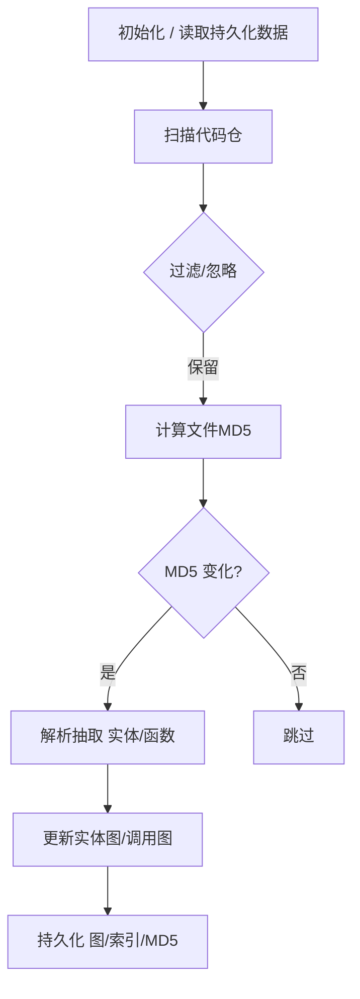

### 代码仓分析规划（planning）

本规划设计一个稳健、可增量更新的代码仓分析流程，覆盖实体提取、调用关系构建、查询接口与持久化，充分利用当前代码中的 `TreeSitterParser`、`FunctionInfo`、`CallRelation`、`PetCodeGraph`、`CodeGraph` 等能力。

### 目标
- 提取类、函数代码块，并以 petgraph 保存实体图
- 提取函数调用关系，并以 petgraph 保存调用图
- 提供查询函数 caller/callee 关系
- 提供查询类、函数代码片段
- 支持基于文件 MD5 的增量刷新：当文件 MD5 变更时，刷新对应代码块与调用关系

### 术语与范围
- **实体（Entity）**: 类、函数、结构体、接口等可定位的代码单元。当前重点为类与函数。
- **调用（Call）**: 函数到函数的调用关系。
- **实体图（Entity Graph）**: 以实体为节点的有向图，边用于表达包含（Class → Function）、继承/实现等结构关系。
- **调用图（Call Graph）**: 以函数为节点、以调用为边的有向图。

### 数据模型设计

- 复用现有类型：
  - **函数**: `FunctionInfo`（已存在于 `src/codegraph/types.rs`）
  - **调用关系**: `CallRelation`（已存在）
  - **函数调用图**: `PetCodeGraph<FunctionInfo, CallRelation>`（已存在）

- 新增建议类型（后续迭代实现）：
  - `ClassInfo`：描述类/接口/结构体。
  - `EntityGraph`：`DiGraph<EntityNode, EntityEdge>`，其中 `EntityNode` 可以是 `ClassInfo | FunctionInfo`；`EntityEdge` 支持 `Contains`（类包含函数）、`Inherit`、`Implement`、`Import` 等。
  - `FileMetadata`：`{ path: PathBuf, md5: String, last_updated: Timestamp }`
  - `FileIndex`：文件到实体/函数 ID 的索引映射，用于增量删除与更新。
  - `SnippetIndex`：实体 ID 到代码片段（起止行或直接文本）的索引；也可按需从源文件按行范围即时读取。

- 必要索引（快速查询）：
  - 函数名 → 函数 ID 列表（已存在 `function_names`）
  - 文件路径 → 函数 ID 列表（已存在 `file_functions`）
  - 类名 → 类 ID 列表（新增）
  - 文件路径 → 类 ID 列表（新增）

### 总体流程



### 实施步骤

#### Step 1：遍历解析所有代码文件，提取类与函数代码块
- 文件遍历：基于现有 `CodeParser::scan_directory`，结合 ignore 规则（如 `.gitignore`、`target/`、`node_modules/` 等）。
- 解析：使用 `TreeSitterParser.parse_file(path)` 获取 AST 符号集合；
  - 将 `FunctionDeclaration` 转换为 `FunctionInfo`（填充 `id/name/file_path/line_start/line_end/namespace/language/signature/parameters`）。
  - 将 `ClassDeclaration/StructDeclaration/Interface` 转换为 `ClassInfo`（包含名称、范围、继承/实现信息、成员函数列表）。
  - 同时建立 `SnippetIndex`：记录实体的 `file_path + (line_start, line_end)`；是否预存全文片段可按体积策略选择（默认按需读取）。
- 写入实体图：
  - 节点：`ClassInfo`、`FunctionInfo`；
  - 边：`Contains`（类 → 函数），`Inherit/Implement`（类 → 类），`DefineIn`（可选：文件 → 实体）。
- 索引更新：
  - 更新 `function_names`、`file_functions`（函数）；
  - 新增 `class_names`、`file_classes`（类）。

#### Step 2：遍历解析所有代码文件，建立函数调用关系图（可动态添加）
- 解析函数调用：
  - 从 `TreeSitterParser` 的符号中识别 `FunctionCall`（参考 `src/codegraph/parser.rs`：`SymbolType::FunctionCall`）。
  - 解析调用名、位置（文件路径、行号）。
- 解析与绑定策略：
  - 优先在同一文件的函数集合中按名匹配；
  - 若未命中，则使用全局函数注册表/索引（`function_names`）跨文件查找；
  - 若语言支持命名空间/类成员（如 `Class.method`），优先解析限定名；
  - 对于解析失败的调用，添加 `is_resolved=false` 的边，保留调用位置信息，便于后续修复。
- 动态添加（链表式增量）：
  - 当单个文件新增/修改/删除时：
    1) 删除此文件关联的旧函数节点与其边（通过 `FileIndex` 快速定位）；
    2) 重新解析该文件生成新的函数节点；
    3) 扫描该文件内的调用，按解析策略增量添加边；
    4) 更新统计信息与索引。
  - 这样无需全量重建，具备“链式拼接/替换”的动态更新特性。

#### Step 3：MD5 变更驱动的增量刷新
- 为每个文件维护 MD5：`FileMetadata` 表（可序列化或落地 SQLite）。
- 每次运行：
  - 计算 `current_md5`；若与 `stored_md5` 不同：执行 Step 1/2 的“删除旧 → 解析新 → 增量更新”流程；
  - 若相同：跳过该文件，复用现有图与索引。
- 边界情况：
  - 文件删除：检测到文件不存在，按 `FileIndex` 移除其节点与边；
  - 重命名：可通过 inode 或内容 MD5 识别为“删除+新增”，交由增量机制处理。

### 查询接口设计

- 函数调用查询（基于 `PetCodeGraph` 已有能力）：
  - `get_callers(function_id) -> Vec<(&FunctionInfo, &CallRelation)>`
  - `get_callees(function_id) -> Vec<(&FunctionInfo, &CallRelation)>`
  - `find_functions_by_name(name) -> Vec<&FunctionInfo>`（支持重名/重载返回多个）
  - 若对外暴露 HTTP：提供 `GET /functions/{id}/callers`、`GET /functions/{id}/callees`、`GET /functions?name=...`

- 代码片段查询：
  - `GET /snippet/function/{id}`：按 `file_path + 行范围` 从磁盘读取并返回；
  - `GET /snippet/class/{id}`：同理；
  - 若性能敏感，可选择缓存片段文本于 `SnippetIndex`（小仓/热点函数建议缓存，防止大仓占用内存）。

- 组合查询：
  - `GET /callchain/{id}?max_depth=N`：返回从指定函数出发的调用链（已在 `PetCodeGraph`/`CodeGraph` 提供方法）。
  - `GET /search?symbol=xxx`：综合函数/类名索引返回候选实体。

### 持久化与恢复
- 图持久化：
  - 使用 `serde` 将 `PetCodeGraph`、`EntityGraph` 序列化为 JSON（或 bincode）
  - 存储路径建议：`data/graph/functions.json`、`data/graph/entities.json`
- 索引与元数据：
  - `data/index/file_index.json`（文件 → 实体/函数 ID 列表）
  - `data/index/metadata.json`（MD5 表）或使用 SQLite（推荐：更安全的事务语义和并发能力）
- 启动恢复：
  - 优先从持久化文件恢复图与索引；
  - 若不存在，则全量扫描构建后写回。

### 性能与可扩展性
- 并行解析：
  - 基于 Rayon 线程池对文件解析并行化；
  - 图更新需串行化或细粒度锁保护（建议将解析与抽取阶段并行，图应用阶段批量串行）。
- 大仓优化：
  - 分阶段落盘（分片保存）与定期 checkpoint；
  - 控制内存：片段按需读取 + 热点缓存；
  - 增量优先：尽量避免全量重建。
- 解析健壮性：
  - 单文件失败不影响整体（记录告警、跳过）；
  - 未解析调用以 `is_resolved=false` 记录，便于后续改进解析器。

### 鲁棒性与一致性
- 事务式更新：
  - 对单文件更新：先在临时结构构建“新快照”，再一次性替换旧索引/节点/边；
- 输入清洗：
  - 忽略二进制、大文件、生成文件目录；
- 版本兼容：
  - 为持久化数据添加 `version` 字段，支持将来迁移。

### 渐进式落地计划（Milestones）
- M1：最小可用
  - 使用现有 `CodeParser` 提取函数（`FunctionInfo`）至 `PetCodeGraph`；
  - 扫描 `FunctionCall` 建立调用边，支持跨文件解析与未解析标记；
  - 提供基本查询（caller/callee 按函数 ID 与按名）。
- M2：实体扩展 + 代码片段
  - 新增 `ClassInfo` 与 `EntityGraph`，补齐 `Contains/Inherit/Implement`；
  - 增加 `SnippetIndex` 与 HTTP 接口，支持类/函数片段查询。
- M3：增量与持久化
  - 引入 `FileMetadata` 与 MD5 驱动增量更新；
  - 建立 `FileIndex`，实现文件级原子替换；
  - 增加持久化与启动恢复。
- M4：性能与鲁棒
  - 并行解析、批处理图更新、缓存策略；
  - 指标监控（解析速度、解析失败率、图大小、未解析比例）。

### 与现有实现的对齐要点
- `src/codegraph/parser.rs` 中已有：
  - 简化的函数提取与 `TreeSitterParser` 调用
  - 函数调用关系的构建（`SymbolType::FunctionCall`）
  - `CodeGraph` 与 `PetCodeGraph` 两种图结构支持
- 规划建议：
  - 在保留 `PetCodeGraph` 的同时，引入 `EntityGraph` 以承载类/结构关系；
  - 补齐 MD5 增量与 `FileIndex`，对现有 `_analyze_*` 流程改为“删除旧 → 应用新”的原子更新；
  - 在查询层面复用 `get_callers/get_callees/find_functions_by_name`，新增片段读取接口。

### 关键接口草案（伪代码）

```rust
// 文件级更新（增量）
pub fn refresh_file(path: &PathBuf) -> Result<(), Error> {
    let current_md5 = compute_md5(path)?;
    if Some(current_md5.clone()) == metadata_store.get_md5(path) {
        return Ok(()); // 无需更新
    }

    // 1) 解析新实体/函数/调用
    let symbols = ts_parser.parse_file(path)?;
    let (classes, functions) = extract_entities(&symbols, path);
    let calls = extract_calls(&symbols, path, &function_registry);

    // 2) 原子替换：删除旧 -> 应用新
    let affected_ids = file_index.get_all_ids(path);
    entity_graph.remove_nodes_and_edges(&affected_ids);
    call_graph.remove_nodes_and_edges(&affected_ids);

    for class in classes { entity_graph.add_class(class); }
    for func in functions { call_graph.add_function(func); }
    for rel in calls { call_graph.add_call_relation(rel)?; }

    // 3) 更新索引与MD5
    file_index.rebuild_for(path, classes, functions);
    metadata_store.set_md5(path, current_md5);
    Ok(())
}

// 查询片段（按需读取）
pub fn get_snippet(entity_id: Uuid) -> Result<Snippet, Error> {
    let (path, start, end) = snippet_index.locate(entity_id)?;
    read_lines(path, start, end)
}
```

### 验收标准（Definition of Done）
- 能在中大型仓上稳定完成：实体抽取 + 调用图构建 + 增量刷新（修改/新增/删除）
- 提供函数 caller/callee 查询和类/函数片段查询
- 持久化与恢复可用；非零未解析调用比例可监控并逐步降低
- 具备并行解析与基础监控指标，保证性能可预期